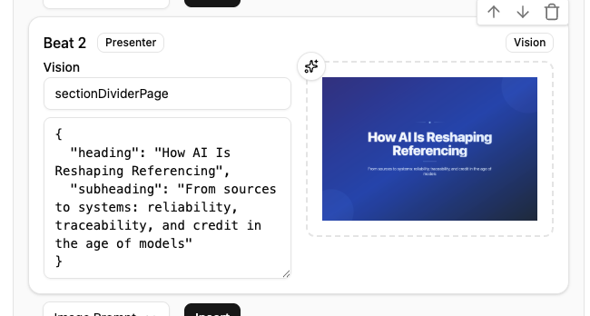

# MulmoCast App 使用方法ガイド

アプリケーションのダウンロードから基本的な使用方法までを詳しく解説します。

## アプリケーション ダウンロード方法

### Mac版のダウンロード

Mac版のアプリケーションは以下のGitHub Actionsページからダウンロードできます。  
https://github.com/receptron/mulmocast-app/actions/workflows/ci-mac.yml

**手順：**
1. 上記のリンクにアクセスし、「Build, Notarize, and Release for macOS」のワークフローページを開きます
   

2. 最新の成功したワークフロー（緑色のチェックマーク付き）をクリックします

3. 画面下部の「Artifacts」セクションで「macOS-release-files」をクリックしてダウンロードします
   

4. ダウンロード完了後、ZIPファイルを解凍します。解凍されたファイルの中に `MulmoCast.app` があります

5. `MulmoCast.app` をアプリケーションフォルダにドラッグ&ドロップしてインストールします
   

6. 初回起動時は以下のポップアップが出ますので、「開く」を選択してください。
    

### (参考) Windows版のダウンロード

Windows版は以下のリンクから同様の手順でダウンロードできます。  
https://github.com/receptron/mulmocast-app/actions/workflows/ci-ms.yml

## アプリケーション 使い方

### 初期設定

アプリケーションを起動すると、オンボーディングが始まります。
オンボーディングに従い、以下の設定を行います。

#### 1. 表示言語の設定
- 日本語または英語から選択できます
- アプリケーションの表示言語を変更します

#### 2. LLM（大規模言語モデル）設定
AI チャット機能で使用するLLM を選択します：
OpenAI / Ollama などが使えます。

**重要**: 選択したLLM に対応するAPI キーの設定が必要です。

#### 3. API キーの設定
2. で選択肢たLLMのAPI キーを設定します。

### （任意） 初期設定
オンボーディングでの設定以外にも以下の設定があります。
右上の設定ボタンから設定が可能です。

#### 1. API キーの設定
AI機能を使用するために、各種サービス（画像/動画/音声生成等）のAPI キーを設定します。
各API の詳細な用途はラベルに表示されます。必要な機能に応じて設定してください。

#### 2. 言語設定
- **スクリプト言語**: 生成するコンテンツの言語
- **翻訳先言語**: 多言語対応時の翻訳先言語

### ダッシュボード

アプリケーションのメイン画面です。ここでプロジェクトの管理を行います。

#### 新規プロジェクトの作成
ダッシュボード画面の「新規作成」ボタンをクリックすると、新規プロジェクトを作成できます。

### プロジェクト編集画面
プロジェクト編集画面は4つのエリアに分かれています。

**構成・基本的な制作フロー**
1.  **AIチャット**: AIと相談しながらスクリプトを作成します。
2.  **スクリプト編集**: 1で作成したスクリプトを調整します。
3.  **出力設定**: 出力形式（動画、音声、PDFなど）を決定し、生成を実行します。
4.  **成果物**: 生成されたコンテンツを確認します。

#### AI チャット
- 設定したLLMと対話しながらコンテンツを作成します。
- URLを入力して、Webページの内容を読み込ませることも可能です。
- スクリプトを作成するには、テンプレートを選んで「入力欄にコピー」し、内容を修正して送信ボタンを押してください。

#### スクリプト編集
- Text
  - 音声生成のベースとなる文章を編集します。
  - 文章の音声への変換や翻訳もここで行います。
- YAML/JSON
  - スクリプト全体をYAMLまたはJSON形式で直接編集します。
- Media  
  - **画像/動画**: プロンプトによる生成、ファイルのドラッグ&ドロップ、URLからの取得が可能です。
  - **スライド**: Markdown、Chart.js、Mermaid記法などを使ってスライドを作成できます。
    > **注**: スライドのテンプレート機能（Vision）は現在開発中です。JSONファイルでテンプレートを指定する方法については、こちらのドキュメントを参考にしてください。
    > 例えば、`html/html/sectionDividerPage.html` を利用する場合、以下のように指定することで、定義済みのテンプレートに基づいたスライドが生成されます。

    

- Style
  - 生成するコンテンツの各種スタイルを設定します。
    - Canvas Size
    - Speech Parameters
    - Image Parameters
    - Movie Parameters
    - Text Slide Parameters
    - Audio Parameters
    - Caption Parameters

#### 出力設定 & 生成
生成したいコンテンツの形式を選択します。
- Movie
- Podcast
- PDF

#### 成果物
生成された各種コンテンツがここに表示されます。
- **動画**: 生成された動画ファイル。
- **PDF**: 生成されたPDFドキュメント。
- **Podcast**: 生成された音声ファイル。
- **スライド**: Mulmo Viewer とも呼びます。スライド単位で確認することも、Auto Play で動画のように見ることも可能です。さらに、右上ボタンから拡大画面での視聴が可能です。
