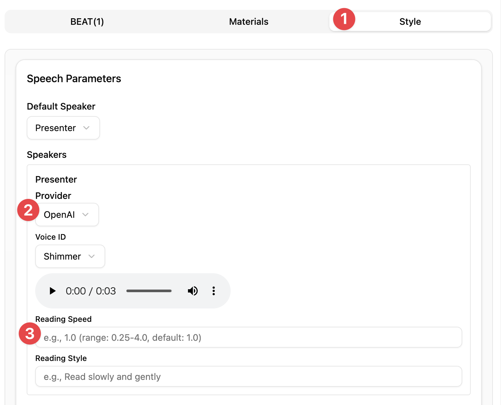
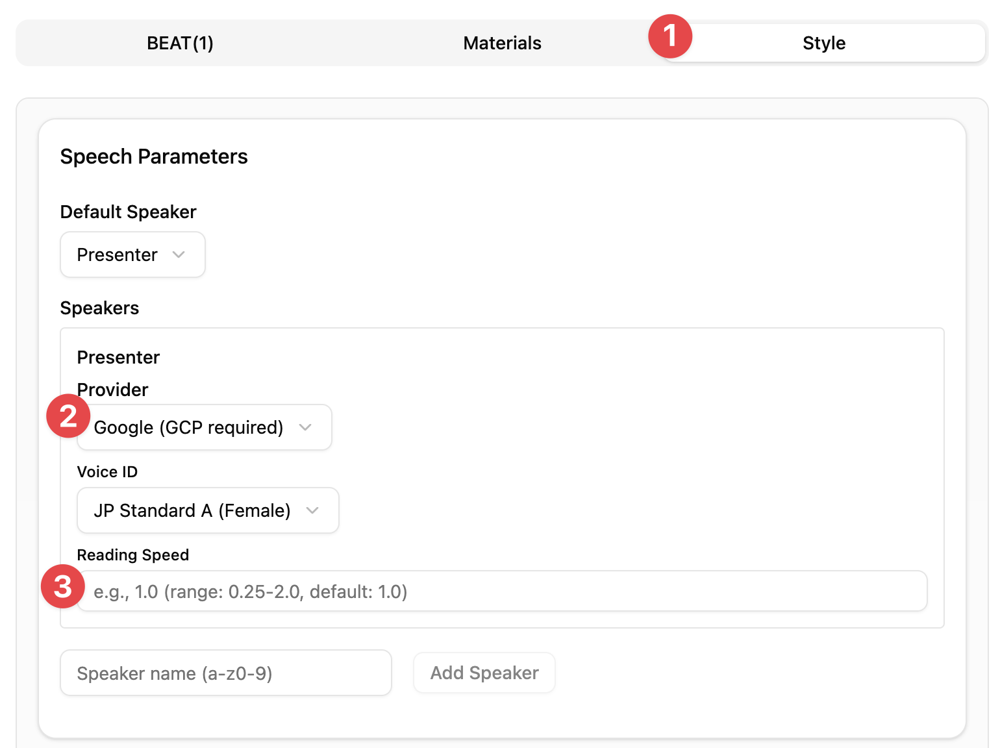
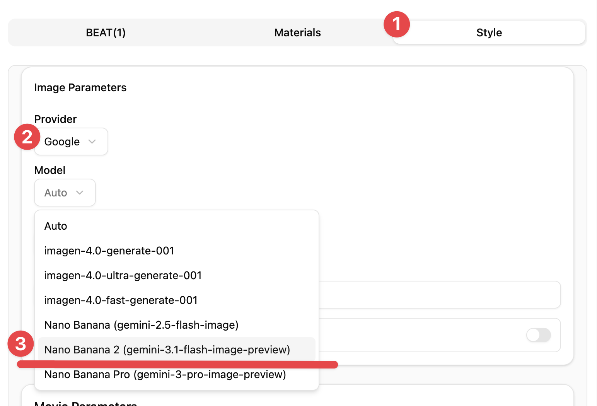

# X Thread Draft for v1.0.12

## メタ情報

- **作成者**: @mulmocast (MulmoCast)
- **スレッド件数**: 3 件（予定）

## メインポスト

📢 MulmoCast v1.0.12 released!

TTS Speed Control
- Adjust speech speed for OpenAI TTS (0.25x–4.0x) & Google Cloud TTS (0.25x–2.0x).
- OpenAI TTS（0.25〜4.0倍速）・Google Cloud TTS（0.25〜2.0倍速）の読み上げ速度を調整可能に。

#MulmoCast #AIvideo #AI動画

### 添付メディア

**文字数**: 254/280

---

## 連投ポスト

### 1. ポスト

Nano Banana 2 (Gemini 3.1 Flash) Image Generation
- New image model: Nano Banana 2 now available in image model selection.
- 新しい画像生成モデル Nano Banana 2 を追加。画像モデル選択から利用可能。

#### 添付メディア

**文字数**: 196/280

---

### 2. ポスト

- Other minor improvements
- その他、軽微な修正

※Update notifications appear in the app. Download from the official website.
※起動中のアプリに更新通知が届きます。ダウンロードは公式サイトから。

#MulmoCast #AIvideo #AI動画

**文字数**: 222/280
