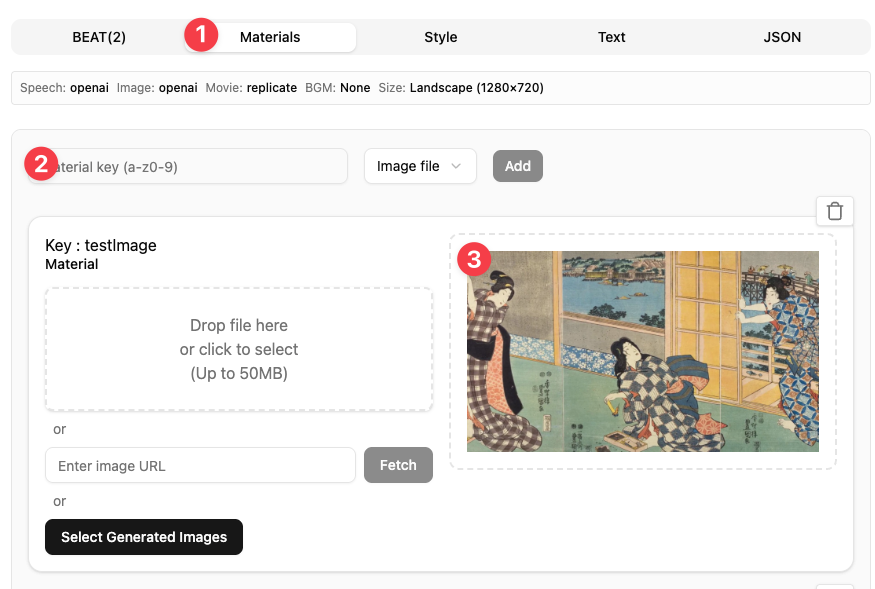
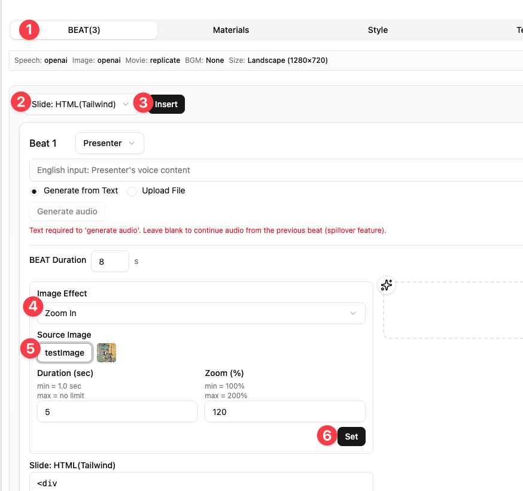
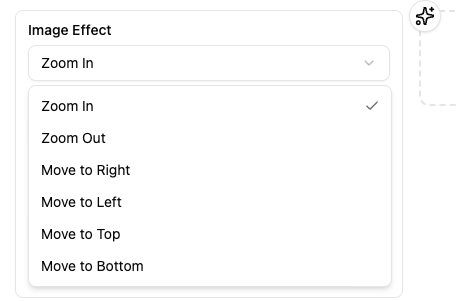
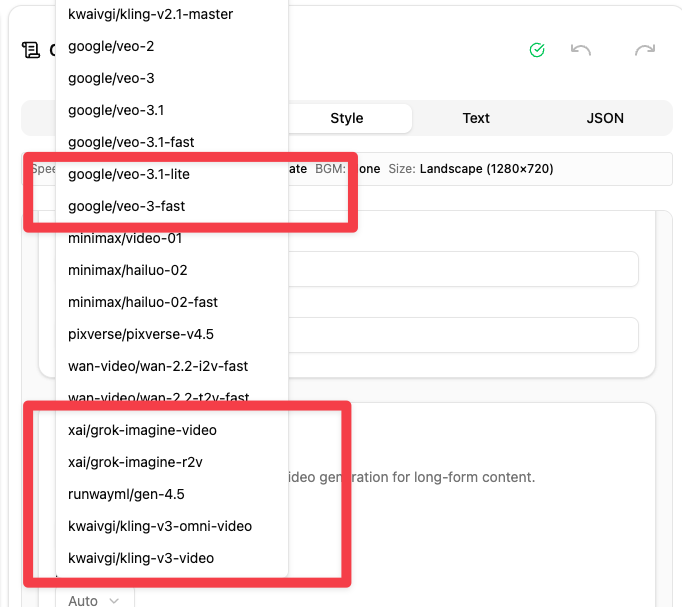

# X Thread Draft for v1.0.13

## メタ情報

- **作成者**: @mulmocast (MulmoCast)
- **スレッド件数**: 4 件（予定）

## メインポスト

📢 MulmoCast v1.0.13 released!

Image Effect UI
- Apply zoom & pan motion to still images — pick presets, choose images from Materials.
- 静止画にKen Burnsエフェクト（ズーム・パン）を追加するUIを搭載。プリセットから選択可能。

#MulmoCast #AIvideo #AI動画

**文字数**: 254/280

### 添付メディア

---

## 連投ポスト

### 1. ポスト

Beat Navigator
- Grid dialog with thumbnails to quickly jump to any beat in TEXT/MEDIA tabs.
- TEXT/MEDIAタブにBeat Navigator追加。サムネイル付きグリッドから任意のビートにジャンプ。

#### 添付メディア

**文字数**: 181/280

---

### 2. ポスト

6 New Video Models
- Veo 3.1 Lite, Veo 3.1 Fast, Grok Imagine Video, Grok Imagine R2V, RunwayML Gen 4.5, Kling v3 Video / Kling v3 Omni Video
- mulmocast 2.4.8→2.6.6で新モデル6種追加。ドロップダウンに自動反映。

#### 添付メディア

**文字数**: 210/280

---

### 3. ポスト

- macOS auto-update fix & other improvements
- macOS自動アップデート修正、その他改善

※Update notifications appear in the app. Download from the official website.
※起動中のアプリに更新通知が届きます。ダウンロードは公式サイトから。

#MulmoCast #AIvideo #AI動画

**文字数**: 259/280
