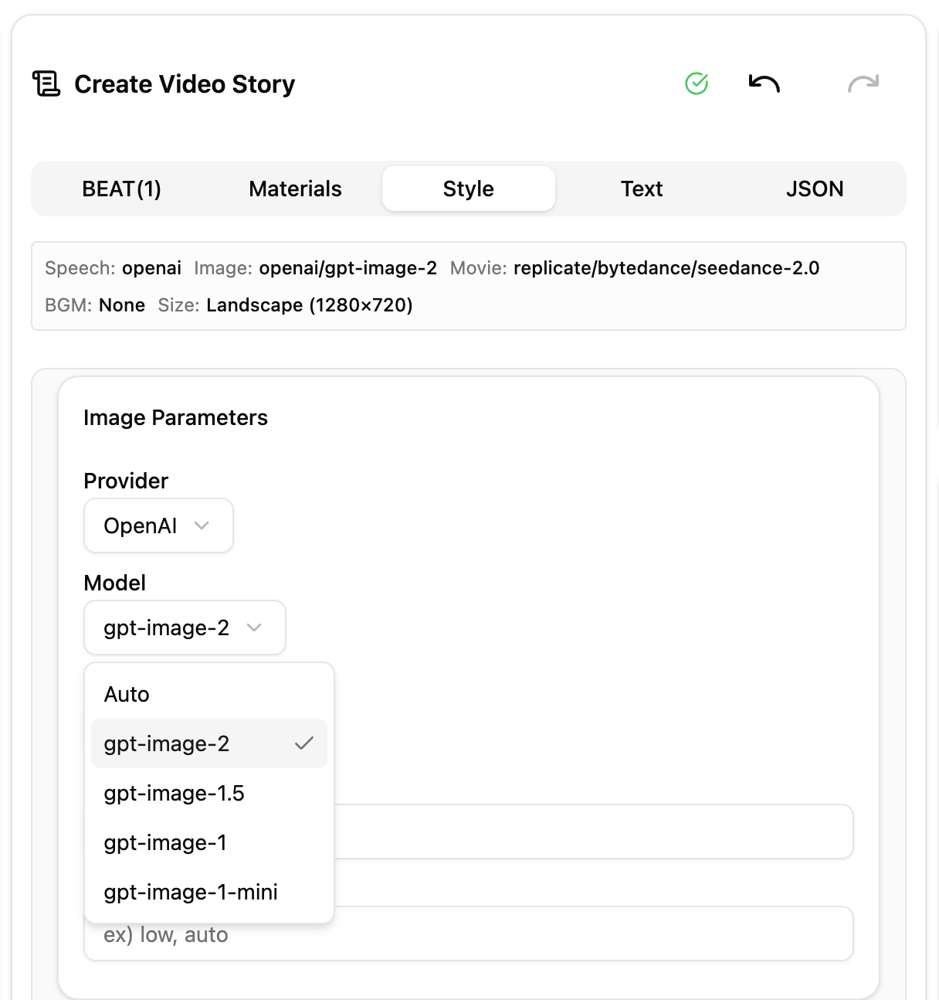
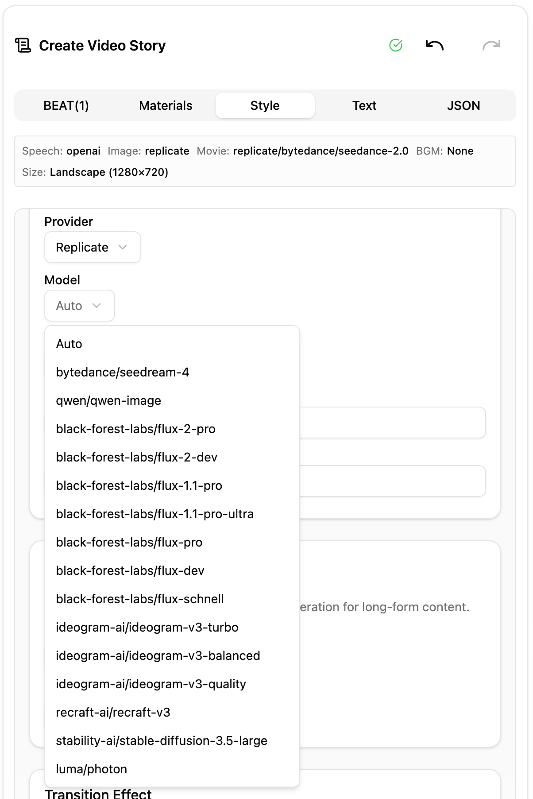
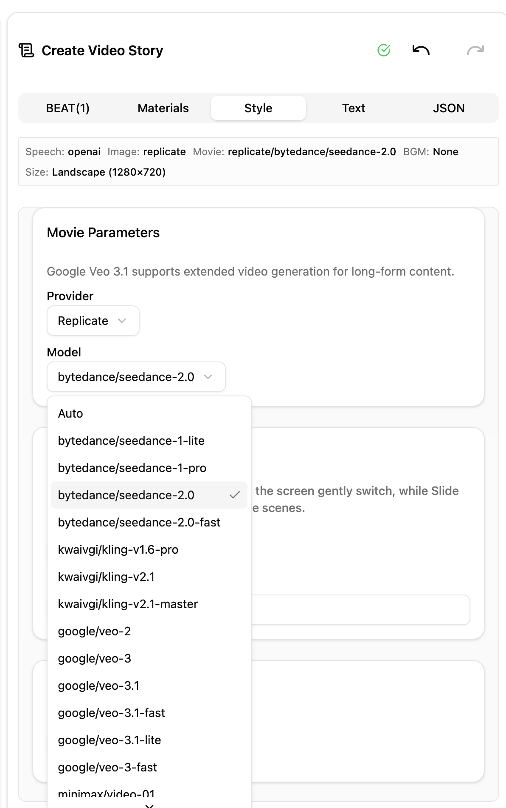
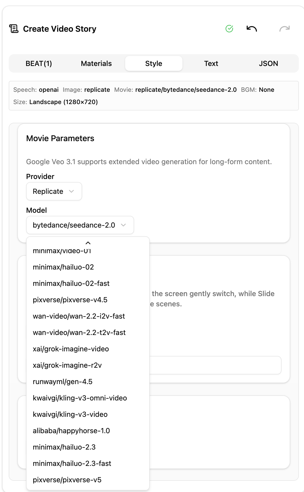
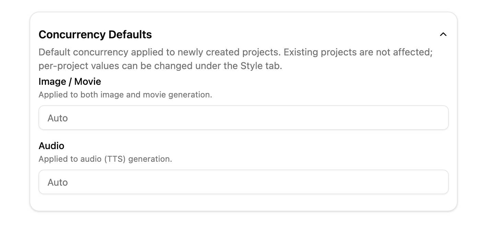
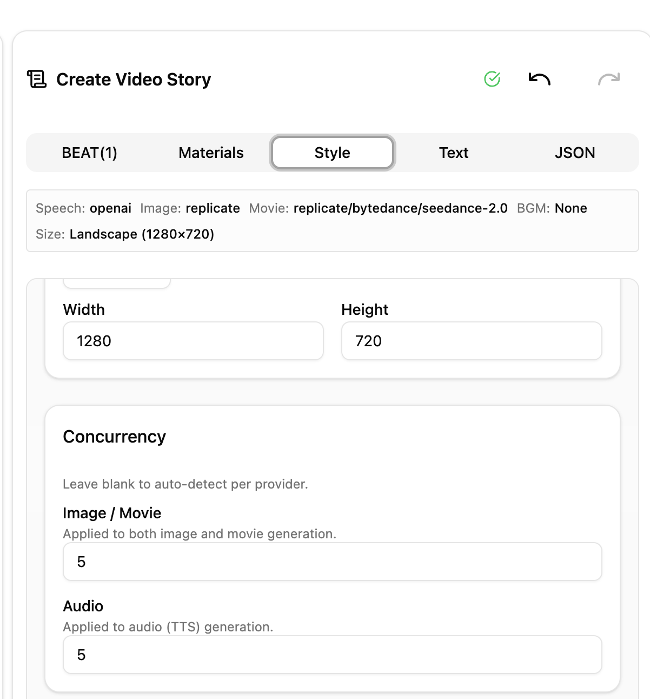

# X Thread Draft for v1.0.14

## メタ情報

- **作成者**: @mulmocast (MulmoCast)
- **スレッド件数**: 5 件（予定）

## メインポスト

📢 MulmoCast v1.0.14 released!

19 new AI models — 13 image + 6 video
画像13種・動画6種の新モデルが選択肢に追加

#MulmoCast #AIvideo #AI動画

### 添付メディア

**文字数**: 140/280

---

## 連投ポスト

### 1. ポスト

Now available
- Images: gpt-image-2, gpt-image-1-mini, Flux 2, Ideogram V3, SD 3.5 Large, Luma Photon
- Videos: Seedance 2.0, Hailuo 2.3, PixVerse v5
- 画像/動画の新モデルが選択肢に登場

#### 添付メディア

**文字数**: 185/280

---

### 2. ポスト

Concurrency settings
- Set image/video/audio generation concurrency per project or as a default
- Tune to your API plan's rate limits
- 画像・動画・音声の同時生成数を設定画面とプロジェクト単位で指定可能に
- APIプランのレート制限に合わせて調整できます

#### 添付メディア

**文字数**: 250/280

---

### 3. ポスト

Model lineup updated
- dall-e-3 & Imagen 4.0 are no longer available. Onboarding default switched to gpt-image-1-mini.
- dall-e-3 / Imagen 4.0 が選択肢から外れました。オンボーディングのデフォルトも gpt-image-1-mini に変更

#### 添付メディア

（任意）

**文字数**: 221/280

---

### 4. ポスト

※Update notifications appear in the app. Download from the official website.
※起動中のアプリに更新通知が届きます。ダウンロードは公式サイトから。

#MulmoCast #AIvideo #AI動画

#### 添付メディア

（任意）

**文字数**: 173/280
